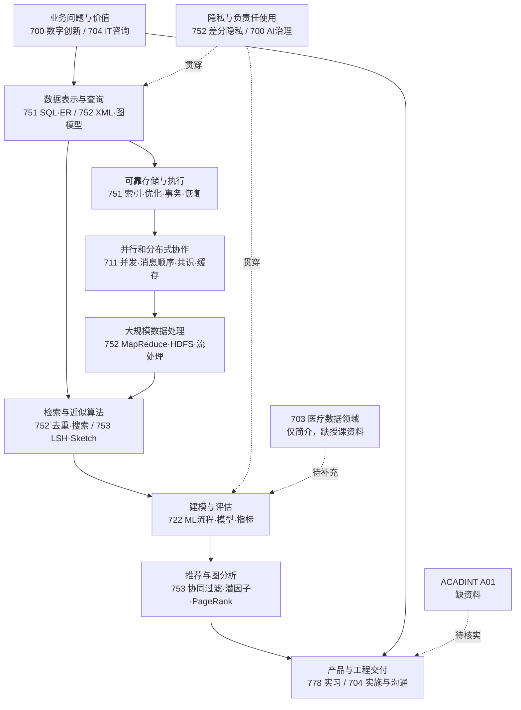

# 总课程知识地图与各课大纲

本轮保留成绩单中的 10 个条目，排除 ELA、720、727。正式课程名称来自用户提供的成绩单；模块来自本地文件正文、原生笔记附件与图片课件识别。**课程已修读、材料已找到、某项技能已熟练掌握，是三个不同判断。**

各节“核心概念”列是复习范围，不代表已经形成经过校验的标准答案。页码采用 PDF 文件的物理页码，可能与幻灯片角标不同。`Fxxx` 为文件索引中的稳定编号。

## 一、完整课程清单

| 课程 | 领域／名称 | 名称可信度 | 内容覆盖依据 |
|---|---|---|---|
| COMPSCI 711 | Parallel and Distributed Computing；并行与分布式计算 | 已确认 | 711 主目录、根目录期中复习；跨并发、体系结构、分布式协调 |
| COMPSCI 751 | Advanced Topics in Database Systems；数据库系统高级专题 | 已确认 | `751/751%25` 和顶层 `751%25` 合并理解，不能把后一目录漏掉 |
| COMPSCI 752 | Big Data Management；大数据管理 | 已确认 | 752 目录的 PDF、日期笔记和 3 份 Word 复习稿 |
| COMPSCI 753 | Algorithms for Massive Data；海量数据算法 | 已确认 | 753 全部资料及根目录 Randomization 副本 |
| INFOSYS 722 | Data Mining and Big Data；数据挖掘与大数据 | 已确认 | 722 目录和错放在 711 的反馈文件 |
| INFOSYS 704 | IT Consultancy；IT 咨询 | 已确认 | 704 课件及根目录 Spark 案例／咨询笔记 |
| INFOSYS 700 | Digital Innovation；数字创新 | 已确认 | 700 中大量图片式日期笔记，以及错放在 711 的数字钱包展示 |
| COMPSCI 778 | Internship；实习 | 名称已确认；材料归属中高可信 | 根目录讲稿明确出现 internship、IdeaSense AI、Sprint 和前端职责，未直接写课程编号 |
| DIGIHLTH 703 | NZ Health Data Landscape；新西兰健康数据环境 | 名称已确认；授课内容缺证据 | 全目录未定位到实际授课材料；仅选课汇编第 31 页有简介 |
| ACADINT A01 | Academic Integrity Course；学术诚信 | 名称已确认；内容未确认 | 未定位到可独立确认的课程资料；不把其他课的引用要求当作该课讲义 |

## 二、COMPSCI 751：数据库系统高级专题

**总体判断：**这是最适合转成软件开发和数据工程八股的材料之一，覆盖从 SQL 到数据库内部机制的连续链路，不只是 SQL 语法课。

| 知识模块 | 核心概念 | 面试连接与适合整理的八股 |
|---|---|---|
| 关系模型与 SQL | 关系、属性、键、约束；选择／投影／连接／集合运算；DDL、DML、聚合、分组、子查询、`EXISTS`、空值、视图、权限 | 开发／DS 通用：JOIN、WHERE 与 HAVING、聚合与去重、子查询；结合 Tutorial 2 实际写查询 |
| 数据建模与分解 | ER 实体／关系、基数、弱实体、ER 到表的映射；更新／插入／删除异常、连接依赖、无损重构 | 表结构设计、冗余与一致性、为何分表后能还原；现有材料明确讲连接依赖，不能凭课名宣称完整覆盖所有范式 |
| 存储与缓冲 | 磁盘／RAID、记录与文件组织、页面、buffer pool、脏页、pin、替换策略、外部归并排序 | 数据超出内存怎么办；I/O 成本；LRU 等替换思想；排序需要几轮读写 |
| 索引 | B+ 树查找／分裂／合并、聚簇与非聚簇索引、复合索引；静态／可扩展哈希、LSM、Bloom filter、空间索引 R-tree | B+ 树与哈希的适用场景；范围查询；索引更新成本；读写取舍；为什么 LSM 常配 Bloom filter |
| 查询执行与优化 | 等价关系代数表达式、选择／投影下推、连接顺序、选择率、索引连接、基数与 I/O 估算 | 慢 SQL 分析、执行计划、减少中间结果、索引为何未必更快；不要直接套成某款数据库的全部实现细节 |
| 事务与并发控制 | ACID、事务边界、提交／回滚、线性 schedule、读写冲突、可串行化、共享／排他锁、两阶段锁、死锁、隔离级别与异常 | 脏读、不可重复读、幻读、丢失更新；死锁与重试；2PL 与可串行化关系 |
| 日志与恢复 | 日志序号、before／after image、WAL、commit 记录、undo／redo、steal／no-steal、force／no-force | 崩溃后为何重做或撤销；提交不等于所有数据页立即落盘；持久性与原子性如何实现 |

**推荐作为八股主干：**SQL → 索引 → 查询优化 → ACID／隔离 → 锁与死锁 → WAL／恢复。外部排序、ER、连接依赖作为第二层；R-tree 和长篇树操作演算按岗位选择。

**代表依据：**[F103：751-4 SQL](../courses/COMPSCI751/source/751/751%2525/751-4.pdf)；[F104：Buffer Manager and Sorting](../courses/COMPSCI751/source/751/751%2525/8_BufferManager_Sorting.pdf)，第 3–17 页；[F105：B+ 树](../courses/COMPSCI751/source/751/751%2525/9_Index_Btree.pdf)；[F096：Hashing／LSM](../courses/COMPSCI751/source/751/751%2525/10_Index_Hashing.pdf)，第 25–40 页；[F107：连接依赖](../courses/COMPSCI751/source/751/751%2525/DB351_2025_wk7_2_751.pdf)；[F118：查询成本](../courses/COMPSCI751/source/751/751%2525/db51_2025_wk8_2_09cs751.pdf)；[F115：隔离级别](../courses/COMPSCI751/source/751/751%2525/DB51_2025_IsoLevels.pdf)；[F114：持久性与恢复](../courses/COMPSCI751/source/751/751%2525/DB51_2025_GWdurability.pdf)。[F129：6 月 15 日笔记](../courses/COMPSCI751/notes/original/751/751%2525/%E7%AC%94%E8%AE%B0%202025%E5%B9%B46%E6%9C%8815%E6%97%A5.pdf)同时混有 RDF／SPARQL 和事务复习，不能将整份笔记机械归为单一模块。

## 三、COMPSCI 711：并行与分布式计算

**总体判断：**内容同时涉及单机并行／硬件性能和分布式协调。适合后端、系统、基础设施面试，也能支撑数据平台与 AI 服务的可靠性讨论。

| 知识模块 | 核心概念 | 面试连接与适合整理的八股 |
|---|---|---|
| 并行体系结构 | 处理器执行、流水线、超标量、指令级并行、Cache、局部性、多处理器缓存一致性 | 性能瓶颈、为什么并行不等于线性加速；缓存与内存访问成本；硬件 Cache 与 Web cache 要区分 |
| 进程、线程与同步 | 进程／线程、共享状态、互斥、monitor、条件变量、等待与唤醒 | 进程和线程区别、竞态、临界区、互斥与条件同步；能解释代码为什么需要同步 |
| 分布式时间与消息顺序 | happens-before、Lamport 时间戳、向量时钟、偏序／全序；FIFO／因果／全序多播、可靠多播、虚拟同步 | 事件顺序不等于墙上时间；如何判断并发；消息按何种规则交付；全序与因果序的区别 |
| 分布式互斥与死锁 | 安全性、活性、公平性；集中式、Ricart–Agrawala、Maekawa quorum、Raymond token；wait-for graph、AND／OR 死锁、Echo | 单点故障、消息开销、仲裁集合、分布式锁取舍；死锁检测和普通可串行化冲突图不能混为一谈 |
| 全局状态与分布式回收 | Chandy–Lamport snapshot、进程状态、通道中消息、一致切面；引用计数、加权引用计数、循环引用 | 一致快照／检查点的基础；为什么局部状态拼起来未必是一致的全局状态；分布式对象生命周期 |
| 共识、复制与一致性 | 共识问题、FLP、Paxos、多数派；强／弱／最终一致性、CAP、BASE、分区与副本冲突 | 网络分区下的选择、复制系统如何达成一致；共识和事务提交问题的区别；2PC／3PC 在复习题材料中出现 |
| Web 缓存与网络实践 | 缓存命中、过期内容、缓存粒度；C# 网络中间件、TCP、异步收发 | 系统设计中的缓存有效性；客户端／服务端消息流、并发连接与故障处理 |

**推荐作为八股主干：**进程／线程与同步、逻辑时钟、消息有序性、CAP 与一致性、Paxos 基本机制、死锁、缓存。分布式 GC 和特定互斥算法的逐步证明为较低优先级专题。

**代表依据：**[F076：Threads & Processes](../courses/COMPSCI711/source/711/1/Threads%2B%2526%2BProcesses.pdf)；[F053：Monitors](../courses/COMPSCI711/source/711/1/Monitors-Additional.pdf)；[F045：711（1）](../courses/COMPSCI711/notes/original/711/1/711%20%EF%BC%881%EF%BC%89.pdf)与[F041：711 2](../courses/COMPSCI711/notes/original/711/1/711%202.pdf)的图片笔记；[F043：多播](../courses/COMPSCI711/notes/original/711/1/711%203.pdf)，第 7–92 页；[F037：3.19 分布式互斥](../courses/COMPSCI711/notes/original/711/1/3.19.pdf)；[F068：snapshot](../courses/COMPSCI711/notes/original/711/1/S7%2Bsnapshot%20%282%29.pdf)；[F072：Paxos](../courses/COMPSCI711/notes/original/711/1/S8%2Bpaxos.pdf)；[F074：Consistency and CAP](../courses/COMPSCI711/notes/original/711/1/S9%2BnoSQL.pdf)；[F054：多处理器 Cache](../courses/COMPSCI711/source/711/1/Multiprocessor%2BCaches.pdf)；[F330：根目录 midblock review](../courses/COMPSCI711/notes/original/midblock%20review.pdf)。

**项目材料边界：**[F058：PRESENTATION](../courses/COMPSCI711/notes/original/711/1/PRESENTATION.pdf)自述 C# 多线程 Chess server、TCP／HTTP1.1 和 JavaScript 客户端，可用作项目回忆线索；这份自我介绍不等于代码或验收证据。711 目录里的数字钱包展示属于 700 主题，722 反馈属于 722，不计入 711 的授课范围。

## 四、COMPSCI 752：大数据管理

**总体判断：**重点是数据如何表示、查询、采集、处理与保护。与 751 相比，更多是半结构化／图数据和大规模处理；与 753 相比，更侧重数据管理流程。

| 知识模块 | 核心概念 | 面试连接与适合整理的八股 |
|---|---|---|
| 半结构化数据 | XML 树、元素／属性、类型与 schema；XPath 轴、路径、谓词；XQuery 序列模型、FLWOR | 数据格式、树状数据查询、声明式查询；XML 细节在特定企业集成岗位价值较高 |
| 图模型与图查询 | Property Graph、RDF 三元组、图模型扩展；Cypher／Neo4j、SPARQL、路径表达式、RPQ／CRPQ、查询逻辑与代数 | 关系库与图数据库选型；节点、边、属性、路径；知识关系查询；适合图检索与知识库岗位 |
| 知识图谱 | 实体、关系、知识抽取／整合、构建流程、质量与挑战 | AI 数据层、结构化知识、实体关系管理；可以衔接知识增强应用，但不据此宣称学过完整 RAG 系统 |
| Web 数据获取与清洗 | 爬取、近重复检测、文本表示、TF-IDF、相似度、similarity join、搜索与 PageRank | 数据采集与去重、文档检索、数据质量；也可作为 AI 语料准备的基础 |
| 分布式批处理 | Map、Shuffle、Reduce；HDFS、Hadoop、Spark；MapReduce 版 PageRank／相似连接 | 数据工程流水线、分组聚合、数据分区与移动成本；区分框架原理和实际部署经验 |
| 数据流与有限内存 | 数据流模型、固定比例／reservoir 抽样、Bloom filter、Misra–Gries heavy hitters | 无法保存全量数据时如何抽样、去重或估算热点；与 753 合并复习避免重复 |
| 差分隐私 | 匿名化的局限、相邻数据集、隐私参数、敏感度、噪声机制、隐私与效用取舍 | DS／AI 数据治理、为什么“删姓名”不充分、发布统计信息的边界；本轮不提供合规结论 |

**推荐作为八股主干：**MapReduce／Shuffle、HDFS 基础、图数据模型与 Cypher／SPARQL、去重与相似度、reservoir、Bloom filter、差分隐私直觉。RPQ 系列形式语言和 XML 全部语法作为岗位相关专题。

**代表依据：**[F203：752 2 XML](../courses/COMPSCI752/notes/original/752/752%EF%BC%881%EF%BC%89/752%202.pdf)；[F205：752-3 XPath](../courses/COMPSCI752/notes/original/752/752%EF%BC%881%EF%BC%89/752-3.pdf)；[F219：XQuery](../courses/COMPSCI752/notes/original/752/752%EF%BC%881%EF%BC%89/slxquery.pdf)；[F211：graph-models](../courses/COMPSCI752/notes/original/752/752%EF%BC%881%EF%BC%89/graph-models.pdf)；[F213：graph_queries_2025](../courses/COMPSCI752/notes/original/752/752%EF%BC%881%EF%BC%89/graph_queries_2025.pdf)；[F214：Knowledge Graph](../courses/COMPSCI752/source/752/752%EF%BC%881%EF%BC%89/KG_1253%20%282%29.pdf)；[F199：Data Cleaning](../courses/COMPSCI752/source/752/752%EF%BC%881%EF%BC%89/1253_Data_Cleaning.pdf)；[F216：MapReduce Framework](../courses/COMPSCI752/source/752/752%EF%BC%881%EF%BC%89/MapReduce%2BFramework.pdf)；[F220：Differential Privacy](../courses/COMPSCI752/source/752/752%EF%BC%881%EF%BC%89/W10_Differential%2BPrivacy%20%282%29.pdf)；[F227：复习笔记.docx](../courses/COMPSCI752/notes/original/752/752%EF%BC%881%EF%BC%89/%E5%A4%8D%E4%B9%A0%E7%AC%94%E8%AE%B0.docx)。图片式日期笔记中，[F231：5 月 20 日](../courses/COMPSCI752/notes/original/752/752%EF%BC%881%EF%BC%89/%E7%AC%94%E8%AE%B0%202025%E5%B9%B45%E6%9C%8820%E6%97%A5.pdf)是差分隐私，[F233：6 月 3 日](../courses/COMPSCI752/notes/original/752/752%EF%BC%881%EF%BC%89/%E7%AC%94%E8%AE%B0%202025%E5%B9%B46%E6%9C%883%E6%97%A5.pdf)是流处理与隐私考前练习。

## 五、COMPSCI 753：海量数据算法

**总体判断：**这是大规模检索、推荐与数据摘要的算法课程，不应把它简单命名为“深度学习课”。很多概念可用于 AI 工程，但完整现代 LLM 训练栈并非已确认的课程模块。

| 知识模块 | 核心概念 | 面试连接与适合整理的八股 |
|---|---|---|
| 数学与随机算法基础 | 向量／矩阵、特征值／特征向量、概率与期望；Monte Carlo／Las Vegas、随机化、通用哈希 | 复杂度与概率保证；哈希碰撞；精确性、速度、空间之间的选择 |
| Web 与大图分析 | 随机游走、PageRank、迭代计算、图结构 | 排序／图分析；解释 PageRank 的直觉、迭代和特殊节点处理 |
| 社区检测与影响力 | 边介数、Brandes、Girvan–Newman、谱聚类、modularity；影响传播与影响力最大化 | 图数据科学、社交网络分析；偏专题，通常晚于通用 ML／SQL |
| 相似搜索与 LSH | shingles、Jaccard、MinHash、签名、banding；距离／相似度、局部敏感哈希、近似近邻 | 大规模去重、候选召回；为什么 LSH 与普通哈希目标不同；banding 如何影响误报／漏报 |
| 流式抽样和过滤 | 固定比例抽样、reservoir sampling、Bloom filter、空间与误报率 | 海量日志采样、成员查询、内存约束；适合小型算法题与原理题 |
| 重频项与频率摘要 | Misra–Gries、Count-Min Sketch、Count Sketch、哈希桶、符号哈希、误差方向／概率界 | 热点统计、近似聚合；三种摘要的估算方式、误差与空间代价 |
| 推荐系统基础与评估 | 内容推荐、用户／物品协同过滤、相似度和插值权重、稀疏性、冷启动；RMSE、Precision@N、Recall@N、排名评估 | 推荐／搜索岗位核心；评分预测与 Top-N 排序不是同一个目标 |
| 潜因子与进阶推荐 | 低秩潜因子、矩阵分解、偏置项、正则化、SGD；上下文／session 推荐、张量分解、Factorization Machines | 推荐建模、过拟合、特征交互；进阶部分优先服务推荐岗位，不泛化成“已学完神经推荐” |

**推荐作为八股主干：**Bloom／reservoir → MinHash／LSH → Sketch 比较 → 协同过滤／矩阵分解／冷启动／评估。PageRank 次之；谱聚类、影响力最大化和张量分解按目标岗位深入。

**代表依据：**[F240：课程介绍](../courses/COMPSCI753/source/753/W1%2B-%2BIntro%2B%2526%2BAdmin.pdf)；[F235：Tutorial 1](../courses/COMPSCI753/source/753/2025_S2_CS752_Tut1_Q.pdf)文件名虽写 CS752，正文明确为 COMPSCI 753；[F255：LSH I](../courses/COMPSCI753/source/753/W5.1%2B-%2BLSH%2BAllPairs%2BI.pdf)；[F258：LSH III](../courses/COMPSCI753/source/753/W6%2B-%2BrNNS.pdf)；[F262：CountMinSketch](../courses/COMPSCI753/source/753/W8.1_Stream%2BCountMin%2BSketch.pdf)；[F263：Count Sketch](../courses/COMPSCI753/source/753/W8.2_Stream%2BCount%2BSketch.pdf)；[F264：推荐基础](../courses/COMPSCI753/source/753/W9.1%2B-%2BBasics%2Bof%2BRecommender%2BSystems.pdf)；[F244：潜因子](../courses/COMPSCI753/source/753/W10.1%2B-%2BLatent%2BFactor%2BModel%20%282%29.pdf)；[F246：进阶推荐](../courses/COMPSCI753/source/753/W10.2%2B-%2BAdvanced%2Btopics%2Bof%2BRS.pdf)。[F267：10 月 29 日](../courses/COMPSCI753/notes/original/753/%E7%AC%94%E8%AE%B0%202025%E5%B9%B410%E6%9C%8829%E6%97%A5.pdf)和[F268：10 月 30 日](../courses/COMPSCI753/notes/original/753/%E7%AC%94%E8%AE%B0%202025%E5%B9%B410%E6%9C%8830%E6%97%A5.pdf)是算法复习笔记，而不是可忽略的日期文件。

## 六、INFOSYS 722：数据挖掘与大数据

**总体判断：**提供 Data Science／应用 ML 面试的流程、传统模型与评估基础。和 753 互补：722 侧重如何完成一次建模任务，753 侧重海量数据条件下的特定算法。

| 知识模块 | 核心概念 | 面试连接与适合整理的八股 |
|---|---|---|
| 问题与分析任务定义 | 决策支持、描述／诊断／预测／处方分析；分类、估计、关联、聚类；业务目标与分析目标 | 把业务问题转成标签、特征、目标变量和成功指标；避免为建模而建模 |
| 数据挖掘流程 | KDD、CRISP-DM、业务理解、数据理解／准备、建模、评估、应用；数据探索、缺失值和异常值 | 如何组织端到端 DS 项目；为什么模型训练只是其中一环 |
| 监督学习 | 回归／OLS、分类、决策树／规则、朴素贝叶斯、kNN、SVM、神经网络入门 | 算法适用条件、解释性、线性与非线性边界；旧 SPSS 讲义的工具细节不是当前全部 ML 工具链 |
| 无监督与关联规则 | K-means、层次／密度聚类类型、类内与类间质量；Apriori、support、confidence | 分类与聚类区别、如何选 k、规则的支持度和置信度；不可把关联当因果 |
| 泛化与评估 | 训练／验证／测试、参数与超参数、交叉验证、模型复杂度、过拟合／欠拟合、正则化；混淆矩阵、Precision／Recall、ROC／AUC、回归误差 | DS／AI 高价值八股；指标选择、评估设计与模型选择；后续补充实践时要专门检查数据泄漏 |
| 文本与流式数据 | 文本特征、停用词、文本分类、流数据窗口、实时采集 | 非结构化数据预处理、在线／离线数据差异；不能据此推断掌握 Transformer 训练 |
| 分析系统与模型管理 | DSS、模型库、模型／数据／求解器的分离；Lambda 架构、lakehouse、ML lifecycle／MLOps 概览 | 将模型接入实际系统、训练到使用的链路；讲座层面的概览与亲手部署要区分 |
| 研究与行业案例 | Design Science Research 的问题、artifact、评价；行业数据分析、医疗急救预测、数据叙事 | 论证方案是否解决问题、解释指标与业务结果；医疗案例来自 722 讲座，不能冒充 703 材料 |

**推荐作为八股主干：**监督／无监督、数据切分、交叉验证、过拟合／正则化、混淆矩阵、Precision／Recall、ROC／AUC、常见模型取舍、CRISP-DM。工具按钮操作和讲座公司背景低优先级。

**代表依据：**[F088：Data Mining Tasks](../courses/INFOSYS722/source/722/722%201/Data%2BMining%2BTasks%2B722%2BV3.pdf)；[F087：SPSS Workshop](../courses/INFOSYS722/source/722/722%201/Clementine%2BSPSS%2BModeller%2BWorkshop%2BV2.pdf)；[F089：Ying 讲座](../courses/INFOSYS722/source/722/722%201/INFOSYS%2B722%2BGuest%2BLecture_Ying.pdf)，第 3–63 页，尤其第 32–47 页评估部分；[F090：Models and Their Management](../courses/INFOSYS722/source/722/722%201/Models%2Band%2BTheir%2BManagement.pdf)；[F083：Design Science Research](../courses/INFOSYS722/source/722/722%201/722%2BDesign%2BScience%2BResearch%2B2025.pdf)；[F086：Real World 2025](../courses/INFOSYS722/source/722/722%201/Big%2BData%2BAnalytics%2B%2526%2BML%2Bin%2BReal%2BWorld%2B2025-10.pdf)。最后一份有字体编码异常，本轮采用图像核验补充判断，不根据乱码细化结论。

## 七、INFOSYS 704：IT 咨询

**总体判断：**对技术面试的贡献主要是需求澄清、方案论证、交付与沟通；对于咨询、BA、解决方案工程师尤其有用。

| 知识模块 | 核心概念 | 面试连接与适合整理的八股 |
|---|---|---|
| 咨询与业务问题定义 | 咨询生态／角色、客户需求、Problem Statement、McKinsey problem-solving、假设驱动、MECE、issue tree | 面试中如何拆问题、区分症状和根因、询问约束；适合案例题框架 |
| 组织和战略分析 | 价值链、业务背景、SWOT／PESTEL 等框架、MIT90 的战略／结构／流程／技术／人员对齐 | 为什么技术方案未必解决组织问题；需求分析和 stakeholder discussion |
| 数据收集与解释 | 客户数据、访谈、分析计划、证据、模式解释 | 如何验证假设、选择业务指标、把分析转化为可执行建议 |
| 业务流程生命周期 | 识别、AS-IS 建模、分析、TO-BE 改进、实施、执行、监控；瓶颈、自动化、SMART 目标 | 系统设计前的业务流程；如何衡量改进是否有效 |
| 企业系统与集成 | ERP／CRM／SCM、SAP 系统、企业数据与业务流程、配置和定制 | 企业软件／解决方案面试；可谈集成问题，不以讲座出席代替 SAP 实施经历 |
| 项目实施与变更 | Waterfall／迭代方法、范围／时间／质量、分阶段与 Big Bang、FURPS、测试、上线准备、风险与变更管理 | 功能与非功能需求、上线取舍、验收、范围蔓延；和 778 实习项目联动 |
| 方案呈现与价值 | Executive Summary、客户情境、成功标准、实施路线、费用与价值、buy-in | 清楚解释“为什么做、怎么做、怎么判断有效”；偏行为／案例面试 |

**推荐复习形式：**把问题拆解、AS-IS／TO-BE、FURPS、风险和发布策略整理成简短问答；把 Spark 组织协作案例整理成“问题—证据—方案—指标”的案例。无需把全部咨询框架和 SAP 产品页机械背诵。

**代表依据：**[F025：Lecture 3](../courses/INFOSYS704/source/704/Week%2B1%2B704%2B2025%2BLecture%2B3.pdf)；[F022：Lecture 4 较长版本](../courses/INFOSYS704/source/704/Week%202%20704%202025%20Lecture%204%20.pdf)；[F028：Process Lifecycle](../courses/INFOSYS704/source/704/Week%2B4%2B704%2B2025%2BLecture%2B6%2BV3.pdf)；[F029：Implementation Roadmaps](../courses/INFOSYS704/source/704/Week%2B5%2B704%2B2025%2BLecture%2B7%2BV1.pdf)；[F030：Presenting Your Proposal](../courses/INFOSYS704/source/704/Week%2B5%2B704%2B2025%2BLecture%2B8%2BV2.pdf)；[F021：Enterprise Systems](../courses/INFOSYS704/source/704/Enterprise%2BSystems%2BGuest%2BLecture%2B-%2BMay%2B2025.pdf)；[F335：根目录 10 月 23 日 Spark／MIT90 讲稿](../courses/INFOSYS704/notes/original/%E7%AC%94%E8%AE%B0%202025%E5%B9%B410%E6%9C%8823%E6%97%A5.pdf)；[F345：9 月 15 日咨询笔记](../courses/INFOSYS704/notes/original/%E7%AC%94%E8%AE%B0%202025%E5%B9%B49%E6%9C%8815%E6%97%A5.pdf)。

## 八、INFOSYS 700：数字创新

**总体判断：**大量内容藏在日期命名的图片式课件里。课程覆盖技术如何创造价值、被组织采用，以及相关风险，适合 AI 产品、云方案和业务场景讨论。

| 知识模块 | 核心概念 | 面试连接与适合整理的八股 |
|---|---|---|
| 创新与转型 | 创新、数字化、数字转型；渐进／激进／颠覆式／开放创新、Triple Helix | 区分技术功能与业务变革；适合作为产品案例的开场框架 |
| 技术采用与反思 | Technology Acceptance Model、感知有用性／易用性、Hype Cycle、采用障碍、反思学习 | 用户为何不用产品、POC 为何难扩展；能连接 778 的用户引导设计 |
| IoT、数字孪生与沉浸体验 | 物理与数字对象、数据连接、digital model／shadow／twin、传感器、AR／VR／MR、交互／沉浸感 | 传感器—数据—模型—动作的系统链路；适合物联网或数字孪生岗位，不等于已做底层算法 |
| 云与安全 | 弹性、按需资源、成本、共享责任、身份与访问、Zero Trust；云上文档处理案例 | 云方案设计、责任边界、成本与安全取舍；日期笔记中确有架构图 |
| AI／GenAI 的业务采用 | 企业价值、POC、落地障碍、治理、伦理、信息可靠性、客服／销售助手、Agentic AI 案例 | AI 应用岗位：如何选场景、定义收益、设置边界；不是模型训练原理主课 |
| 数字平台与智慧城市 | 数字媒体、危机信息、智慧交通、能源／垃圾管理、数字身份 | 案例分析、公众服务与数据系统；行业背景为主 |
| 数字钱包与区块链案例 | 支付方式、钱包演进、私钥／热钱包风险、智能合约与跨链风险、供应链追踪 | 安全与系统边界的讨论素材；不因这部分内容重新纳入已退的 727 |

**推荐复习形式：**云共享责任、弹性与成本、数字孪生的基本区别、AI POC 到生产的障碍可转短问答；其余主要做案例卡。演讲中的交易所历史、损失金额和市场预测未逐项核验，不适合原样背诵。

**代表依据：**[F002：700](../courses/INFOSYS700/notes/original/700/700%201/700.pdf)，第 10–18 页；[F009：3 月 19 日数字孪生](../courses/INFOSYS700/notes/original/700/700%201/%E7%AC%94%E8%AE%B0%202025%E5%B9%B43%E6%9C%8819%E6%97%A5.pdf)；[F011：3 月 26 日 VR](../courses/INFOSYS700/notes/original/700/700%201/%E7%AC%94%E8%AE%B0%202025%E5%B9%B43%E6%9C%8826%E6%97%A5.pdf)；[F013：4 月 2 日 AI 采用及 TAM](../courses/INFOSYS700/notes/original/700/700%201/%E7%AC%94%E8%AE%B0%202025%E5%B9%B44%E6%9C%882%E6%97%A5.pdf)，第 9–55 页；[F014：4 月 9 日云与安全](../courses/INFOSYS700/notes/original/700/700%201/%E7%AC%94%E8%AE%B0%202025%E5%B9%B44%E6%9C%889%E6%97%A5.pdf)，第 3–33 页，架构图见第 15 页；[F016：5 月 7 日智慧城市](../courses/INFOSYS700/notes/original/700/700%201/%E7%AC%94%E8%AE%B0%202025%E5%B9%B45%E6%9C%887%E6%97%A5%20%282%29.pdf)；[F019：第四周论文总结](../courses/INFOSYS700/notes/original/700/700%201/%E7%AC%AC%E5%9B%9B%E5%91%A8%E8%AE%BA%E6%96%87%E6%80%BB%E7%BB%93.pdf)；[F052：数字钱包小组展示，原在 711](../courses/INFOSYS700/source/711/1/Group5-presentation%20slides.pdf)。

## 九、COMPSCI 778：实习

**归属说明：**成绩单确认实习课程；以下内容来自实习讲稿与 IdeaSense AI 项目计划，课程编号未出现在文件中，故仍保留归属推测。这里区分“已写出的经验反思”和“计划要做的功能”。

| 模块 | 从材料可确认的内容 | 面试用途／适合复习的形式 |
|---|---|---|
| AI 产品流程与需求 | 问题 → 市场 → 技术 → 报告的阶段化流程；IdeaSense AI、可行性与 DVF 评分出现在计划中 | 解释用户、问题、MVP 与成功标准；DVF 具体实现尚缺证据 |
| 前端交互与状态 | 讲稿描述引导用户逐步推进、减少信息过载、逐步展示工具、支持总结／报告反复修改和保持进度 | 项目深挖：状态如何保存、阶段如何切换、失败如何恢复；目前只有设计叙述，不能补造代码实现 |
| 集成与迭代 | 计划包含前后端框架、数据库连接、LLM 输出整合、PDF 报告、mock API、版本锁定、Sprint 1–4 | 架构和 API 约定、MVP 切分、联调风险；区分计划、完成和实际效果 |
| 工程协作与取舍 | daily standup、pair programming、backup owner、PR review、尽早暴露问题；速度／质量／范围取舍 | 行为面试：困难、冲突、个人贡献、技术债、时间限制与复盘 |
| 演示与价值表达 | 清晰呈现愿景和用户价值；库存／交货对账的用户痛点与市场分析稿是候选项目材料 | 项目故事卡；市场数字与归属都需补证，不能作为已实现项目指标 |

**优先级高，但主要不是背定义。**先形成 2–3 个真实项目故事：用户问题、本人负责部分、关键技术选择、遇到的失败、验证方法、结果。框架、数据库、LLM 型号、部署方式、性能数字与上线情况在当前材料中不足以完整确认，后续需代码／报告佐证。

**代表依据：**[F331：presentation](../courses/COMPSCI778/notes/original/presentation.pdf)，第 1–5 页明确描述前端及 internship；[F336：12 月 5 日 IdeaSense AI 计划](../courses/COMPSCI778/notes/original/%E7%AC%94%E8%AE%B0%202025%E5%B9%B412%E6%9C%885%E6%97%A5.pdf)；[F334：库存对账讲稿](../courses/COMPSCI778/notes/original/%E6%96%B0%E5%BB%BA%20Microsoft%20Word%20%E6%96%87%E6%A1%A3.pdf)仅列作中等可信的项目准备素材，不与 IdeaSense AI 强行合并；[F269：11 月 17 日候选项目名](../courses/COMPSCI778/notes/original/753/%E7%AC%94%E8%AE%B0%202025%E5%B9%B411%E6%9C%8817%E6%97%A5.pdf)位于 753，主题更像实习前期选题。

## 十、DIGIHLTH 703：新西兰健康数据环境

**资料缺口：**本轮完整目录扫描未找到可确认的 703 授课课件／课堂笔记。只在 `IT/选课/选课.pdf` 第 31 页发现课程简介，原文件按范围约定不上传。

以下是**课程简介级方向，不是从实际授课笔记恢复的模块**：

| 简介中的方向 | 可确认的概念范围 | 面试关联与后续八股候选 |
|---|---|---|
| 常规采集的健康数据 | 用大量 routinely collected data 支持医疗服务改进 | 医疗数据来源与适用性；实际数据集、编码体系未确认 |
| 伦理与公平使用 | ethical and equitable use of health data | 偏差、公平性和负责任使用；仅作复习方向，具体方法待课件补证 |
| 数据批判性评价 | critical evaluation of health data | 数据是否适合问题、质量与局限；不自动推断已讲完所有缺失机制 |
| 分析方法与解释 | identification of analytic methods、appropriate interpretation、支持医疗决策 | 如何把分析解释为有边界的决策建议；具体模型与统计检验未确认 |

简介明确写着不分析具体数据集。医疗 DS／health-tech 求职时这一领域有价值；当前不能给出完整八股清单，也不能把 722 的医疗讲座或 711 中自我介绍里的疾病数据项目算作 703 授课证据。

## 十一、ACADINT A01：学术诚信

课程名称由成绩单确认。本目录未定位到可确认的课程文件，因此**主要模块、核心概念和实际授课内容暂不补写**。对软件开发／DS／AI 技术题的直接优先级低。后续若补材料，可判断是否存在适合整理为研究规范、引用和成果归属的内容；此处不是宣称这些模块已得到课件验证。

## 十二、跨课程总知识地图

图中箭头表示复习时的衔接关系，不是学校正式先修要求。

| 合并复习的主题 | 材料来源 | 合并后的重点 |
|---|---|---|
| 缓存 | 711 CPU／Web cache；751 buffer pool | 都在减少访问成本，但层次、失效与一致性机制不同 |
| 一致性与并发 | 711 分布式复制／共识；751 ACID／隔离 | 区分副本一致性、事务一致性、隔离性和消息有序性 |
| 数据模型 | 751 关系／ER；752 XML／RDF／Property Graph | 同一业务何时适合表、文档、图；查询方式和约束如何变化 |
| 大数据抽样与摘要 | 752 流处理；753 sampling／Bloom／Sketch | 752 建立用途与流程，753 补算法、误差与复杂度 |
| 搜索与相似性 | 752 TF-IDF／去重／搜索；753 MinHash／LSH／PageRank | 文本表示、候选生成、相似判断、排序的分工 |
| 模型与推荐 | 722 泛化／评估；753 矩阵分解／推荐指标 | 先验证评估设计，再比较模型；评分误差和排序质量分开 |
| 业务到交付 | 700 创新价值；704 需求／方案；778 实际项目 | 用业务理由解释工程取舍，用实现和结果支撑案例 |

## 十三、材料没有证明覆盖的求职内容

这些是后续对照岗位时的**补充检查项**，不计入“已学课程”：通用数据结构与编码题体系、完整计算机网络／操作系统体系、特定语言运行时和框架、容器／CI/CD 的亲手实践、现代 LLM／Transformer／RAG 的完整实现与评估、系统化统计推断与实验设计。课程中出现部分相关词语，不足以证明系统学习或实操完成。

复习顺序和可转为八股的问题见[面试复习优先级](面试复习优先级.md)；文件保留、误放、重复和无法确认的散页见[资料盘点](资料盘点.md)。
